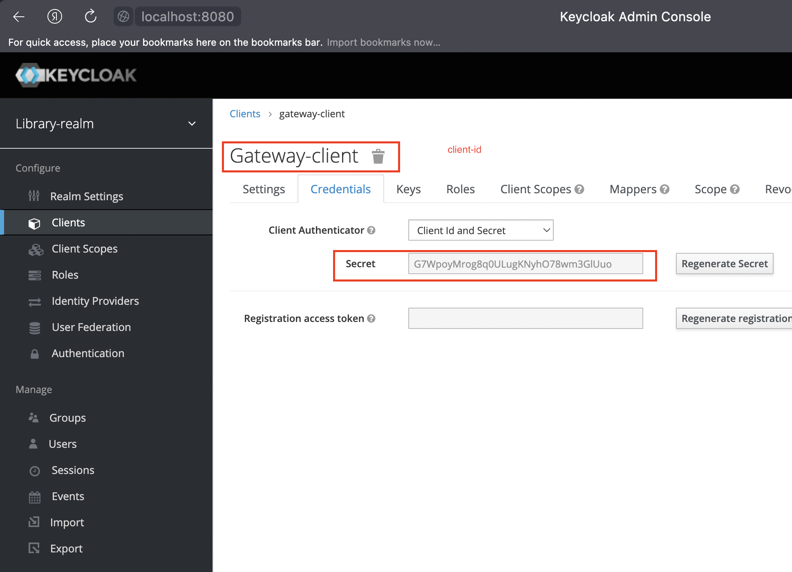

### Library-app

#### 1. Схема сервисов

- _gateway_
- _library-service_
- _Keycloak_
- _MongoDB_
- _Config server_
- _Eureka_

#### 2. Порядок запуска сервисов
- чтобы запустить сервисы используется _docker-compose.yaml_ из директории _/library-app_:

```shell
docker-compose -f docker-compose_arm64.yaml up
```

#### 2.1. Настройки в _docker-compose.yaml_:
- для корректной работы сервисов, нужно уточнить _KEYCLOAK_CLIENT_SECRET_

```yaml
services:
  gateway:
    environment:
      - KEYCLOAK_CLIENT_SECRET=...
```

- _KEYCLOAK_CLIENT_SECRET_ задается в _keycloak_-админке

- по умолчанию в файле `/keycloak-config/realm-export.json` указан тот же _client_secret_, что и в _docker_compose.yaml_;

<details><summary>client-secret в keycloak-админке</summary>



</details>


#### 2.1. Запуск _Keycloak_
- запуск _docker-compose_ из директории _/library-app_:

```shell
docker-compose -f docker-compose_arm64.yaml up
```

<details><summary>Импорт настроек и пользователей в Keycloak при запуске в Docker</summary>

1. для импорта настроек при старте _Keycloak_ в _Docker_ нужно подготовить **единый _json_-файл**;
2. как вариант этом можно сделать следующим образом:
   1. первый раз запустить _Docker_-контейнер без каких-либо импортов;
   2. настроить все как нужно: _realm_'ы, _client_'ы, _role_, _user_'ов;
   3. выполнить экспорт данных из _Keycloak_ данного настроенного состояния - см ниже как эксопртировать данные из _Keycloak_;
   4. в результате для каждого _realm_'а появляются **два файла**:
      1. **файл1** - все настрйоки, кроме _users_;
      2. **файл2** - данные по _users_;
      3. для _realm_'а с названием _library_: **файл1** - _library-realm_, **файл2** - _library-users-0_;
   5. содержимое **файла2** нужно скопировать в **файл1**;
   6. в итоге будет единый файл, который содержит все настройки и данные пользователей для тестового запуска _Keycloak_;
3. **единый _json_-файл** нужно скопировать в папку, соответствующую настроенному _volume_: `./keycloak-config/:/opt/keycloak/data/import/`
    1. в данном примере - нужно скопировать **единый _json_-файл** в папку `./keycloak-config/`;
4. при запуске _Keycloak_ нужно добавить флаг `--import-realm`;

</details>

<details><summary>Экспорт настроек и пользователей из Keycloak, запущенного внутри в Docker</summary>

1. при старте контейнера нужно указать _volume_:

`-v ./keycloak-config/:/opt/keycloak/data/import/`

Это нужно, чтобы созданный далее _realm_ можно было увидеть на локальном компьютере

2. Запускаем контейнер: `docker-compose ... up`

3. Подключаемся внутрь контейнера: `docker exec -it library-app-keycloak-1 bash`
При запуске контейнер через `docker run ...` нужно уточнить _container name_ или _container id_, к которому нужно подключаться;

4. Внутри контейнера идем в папку с _kc.sh_: `cd /opt/keycloak/bin/`

5. Вводим команду: `./kc.sh export --dir /opt/keycloak/data/import/`
Здесь `/opt/keycloak/data/import/` - это путь, у которого указан _volume_, поэтому здесь появятся _export_-файлы из _Keycloak_;

</details>

#### 2.2. Запуск _config-server_
- пока что через `mvn spring-boot:run`

#### 2.2.1. Запуск с использованием локальных _config_'ов

- для того, чтобы запустить _config_'и с _localhost_ в _application.yml_ нужно указать:
    - `profiles: native`
    - для `native` указать `searchLocations`
```yaml
# !! settings for local configs from package 'resources/config'
spring:
  profiles:
    active: native
  cloud:
    config:
      server:
        native:
          searchLocations: "[classpath:/, classpath:/config, classpath:/config/{application}, classpath:/config/{application}/{profile}]"
```

#### 2.2.2. Запуск с использованием _config_'ов из _git_
```yaml
spring:
  cloud:
    config:
      server:
        git:
          uri: https://github.com/rtszh/library-app-configs/
          search-paths: {application}
```

#### 2.3. Запуск _eureka_
- пока что через `mvn spring-boot:run`

#### 2.4. Запуск _gateway_
- пока что через `mvn spring-boot:run`

#### 2.5. Запуск _library-service_
- пока что через `mvn spring-boot:run`

#### 3. Тестирование работы
- _gateway_ запускается на `http://localhost:9090`;
- чтобы получить страницу с `/books` из _library-service_ нужно:
  - перейти на `http://localhost:9090`;
  - залогиниться:
    - аккаунт 1: 
      - login: user1
      - password: password
      - authorities: USER (ROLE_USER)
    - аккаунт 2:
        - login: admin
        - password: password
        - authorities: ADMIN (ROLE_ADMIN)
- после происходит переадресация на _library-service_

#### 4. Экспорт книг в _MongoDB_ с помощью _Spring Batch_-скрипта
- для экспорта книги в _MongoDB_ нужно настроить _application.yaml_ для _prefix=book_:
  - `title` - заголовок экспортируемой книги;
  - `authors` - массив авторов экспортируемой книги;
  - `genres` - массив жанров экспортируемой книги;

```yaml
book:
  title: "Mertvye dushi"
  authors:
    - Gogol
  genres:
    - classic
```

#### 5. Экспорт страниц книг (_pages_) в _MongoDB_ с помощью _Spring Batch_-скрипта
- книги загружаются постранично в _MongoDB_ с использованием _Spring batch_-скрипта;
- сущность страницы `Page` выглядит следующим образом:

```java
import org.springframework.data.annotation.Id;
import org.springframework.data.mongodb.core.mapping.DBRef;
import org.springframework.data.mongodb.core.mapping.Document;

@Document
public class Page {
    @Id
    private String id;

    private String text;

    private int chapter;

    private int pageNumber;

    @DBRef
    private Book bookId;

    // getters and setters
}
```

- таким образом, из _txt_-файла можно экспортировать данные в _MongoDB_, в результате чего каждая страница книги будет хранится как отдельный `Document` в _MongoDB_;
- все страницы всех книг лежат в одной коллекции;
- принадлежность страницы к определенной книге определяется с помощью `@DBRef`;

#### 5.1. Подготовка данных и настройка скрипта для экспорта страниц книги
- необходимо уточнить следующие параметры в _application.yml_:
  - `input-file` - это папка, в которой лежат все файлы, из которых состоит книга;
    - каждый _txt_-файл внутри папки `input-file` - это глава (_chapter_) в книге;
    - если в книге всего одна глава (или нет глав), то можно сложить всю книгу в один _txt_-файл;
    - каждый _txt_-файл разбивается на страницы (_page_) - сущности, в которых количество символов равно параметру `page-size`;
  - `book-name` - название (_title_) книги. Подразумевается, что эта книга (сущность `Book`) уже содержится в БД _MongoDB_, поэтому скрипт сможет найти в книгу в БД по _title_;
  - `page-size` - количество символов на одной странице
```yaml
app:
  input-file: ./input
  book-name: "Kapitanskaya dochka"
  page-size: 4700
```

<details><summary>Пример работы скрипта экспорта данных</summary>

1. Предположим, что в нашей книге две главы. Поэтому в пути `input`, лежит два _txt_-файла;
2. Размер **Файла1** - 10000 символов, **файла2** - 9000 символов;
3. Скрипт сделает так:
   1. для **файла1** разобьет его на 3 страницы - 4700, 4700, 600;
   2. для **файла2** - на 2 страницы - 4700, 4300;
4. в итоге, в БД _MongoDB_ будет хранится 5 страниц: 3 страницы для _chapter1_ и 2 страницы для _chapter2_;
</details>

#### 6. _MongoDB_ запросы

- найти все страницы, которые относятся к заданной книге. Связь книги - через _DBRef_:

```mongodb-json-query
db.page.find({ "bookId" : DBRef("book", ObjectId("645e050689209e0300682aa6")) }) 
```

#### 7. Экспорт всех колекций из _database_ в _MongoDB_
- команду нужно выполнять в _shell_ (в терминале), а не в _MONGOSH_;
  - https://stackoverflow.com/questions/31993168/cant-create-backup-mongodump-with-db-authentication-failed

```shell
mongodump -h localhost:27017 -d library-service -u root -p root -o library-service --authenticationDatabase admin
```

https://altimetrikpoland.medium.com/how-to-control-container-run-order-using-docker-compose-4a7b338b98f1

1. Дальнейшие действия - нужно запустить сервисы 
   2. gateway - зависит от keycloak
   3. library-service - зависит от mongodb и keycloak
   4. соответственно, нужно добавить healthcheck для keycloak и mongodb
   5. для keycloak - как вариант можно просто собрать свой image, внутрь которого установить curl как сделано в config-server

- Ссылка для healthcheck keycloak:
https://www.keycloak.org/server/health#:~:text=You%20may%20use%20a%20simple,HTTP%20client%20for%20this%20purpose.&text=If%20the%20command%20returns%20with,on%20which%20endpoint%20you%20called.

- keycloak нужно добавить в hosts

- нужно записать, что необходимо обновлять secret'ы в config'ах 

```

NOTE To make Keycloak work in our local environment, we need to add the host entry 127.0.0.1 Keycloak to our hosts file. 
If you are using Windows, you need to add the host entry at C:\Windows\System32\drivers\etc\hosts, 
and if you are using Linux, the host file is at /etc/hosts. Why do we need that entry? 
The containers can talk to each other using the network aliases or MAC addresses, but our Postman needs to use localhost
to invoke the services.

```