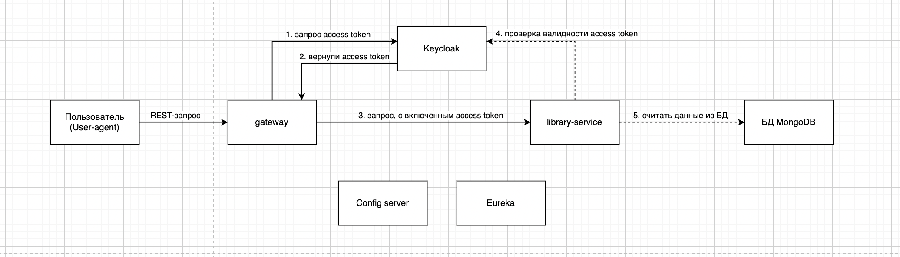

### Library-app

#### 1. Схема сервисов

- _gateway_
- _library-service_
- _Keycloak_
- _MongoDB_
- _Config server_
- _Eureka_

#### 2. Порядок запуска

#### 2.1. Запуск _Keycloak_
- запуск _docker-compose_ из директории _/library-app_:

```shell
docker-compose -f docker-compose.yaml up
```

<details><summary>Импорт настроек и пользователей в Keycloak при запуске в Docker</summary>

1. для импорта настроек при старте _Keycloak_ в _Docker_ нужно подготовить **единый _json_-файл**;
2. как вариант этом можно сделать следующим образом:
   1. первый раз запустить _Docker_-контейнер без каких-либо импортов;
   2. настроить все как нужно: _realm_'ы, _client_'ы, _role_, _user_'ов;
   3. выполнить экспорт данных из _Keycloak_ данного настроенного состояния - см ниже как эксопртировать данные из _Keycloak_;
   4. в результате для каждого _realm_'а появляются **два файла**:
      1. **файл1** - все настрйоки, кроме _users_;
      2. **файл2** - данные по _users_;
      3. для _realm_'а с названием _library_: **файл1** - _library-realm_, **файл2** - _library-users-0_;
   5. содержимое **файла2** нужно скопировать в **файл1**;
   6. в итоге будет единый файл, который содержит все настройки и данные пользователей для тестового запуска _Keycloak_;
3. **единый _json_-файл** нужно скопировать в папку, соответствующую настроенному _volume_: `./keycloak-config/:/opt/keycloak/data/import/`
    1. в данном примере - нужно скопировать **единый _json_-файл** в папку `./keycloak-config/`;
4. при запуске _Keycloak_ нужно добавить флаг `--import-realm`;

</details>

<details><summary>Экспорт настроек и пользователей из Keycloak, запущенного внутри в Docker</summary>

1. при старте контейнера нужно указать _volume_:

`-v ./keycloak-config/:/opt/keycloak/data/import/`

Это нужно, чтобы созданный далее _realm_ можно было увидеть на локальном компьютере

2. Запускаем контейнер: `docker-compose ... up`

3. Подключаемся внутрь контейнера: `docker exec -it library-app-keycloak-1 bash`
При запуске контейнер через `docker run ...` нужно уточнить _container name_ или _container id_, к которому нужно подключаться;

4. Внутри контейнера идем в папку с _kc.sh_: `cd /opt/keycloak/bin/`

5. Вводим команду: `./kc.sh export --dir /opt/keycloak/data/import/`
Здесь `/opt/keycloak/data/import/` - это путь, у которого указан _volume_, поэтому здесь появятся _export_-файлы из _Keycloak_;

</details>

#### 2.2. Запуск _gateway_
- пока что через `mvn spring-boot:run`

#### 2.3. Запуск _library-service_
- пока что через `mvn spring-boot:run`

#### 3. Тестирование работы
- _gateway_ запускается на `http://localhost:9090`;
- чтобы получить страницу с `/books` из _library-service_ нужно:
  - перейти на `http://localhost:9090`;
  - залогиниться:
    - аккаунт 1: 
      - login: user1
      - password: password
      - authorities: USER (ROLE_USER)
    - аккаунт 2:
        - login: admin
        - password: password
        - authorities: ADMIN (ROLE_ADMIN)
- после происходит переадресация на _library-service_